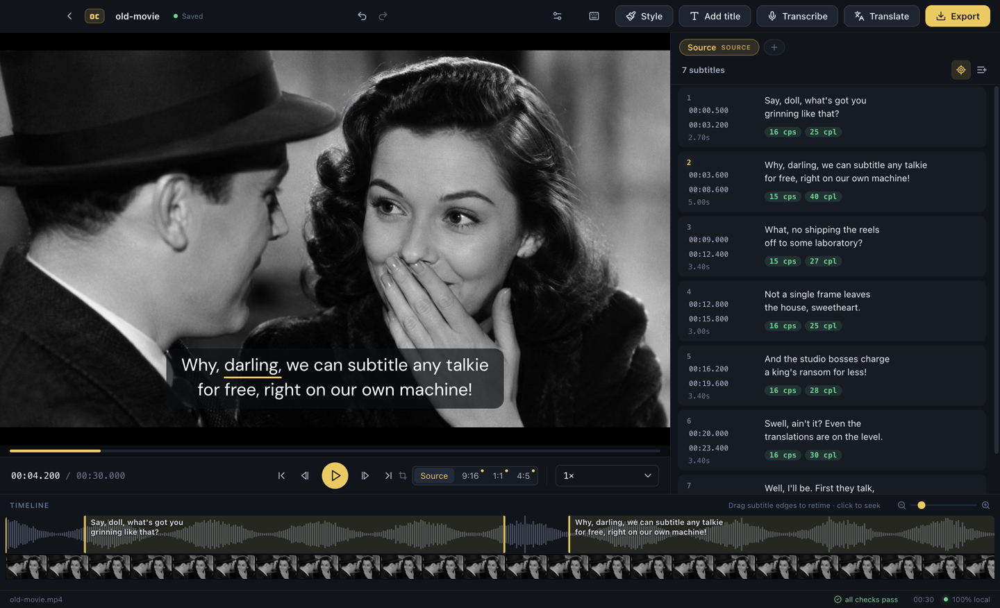

  

# Overcaption

**The free offline subtitle studio for macOS and Windows.**

Overcaption transcribes video on your machine with on-device speech recognition, gives you a real editor to fix text and timing on a waveform, translates locally to around 50 languages, and exports SRT, VTT and plain text or burns styled subtitles straight into the video. No account, no uploads, no watermark. It works with the network cable unplugged.

  <a href="https://api.overcaption.com/download?platform=mac&src=github"><b>Download for macOS</b></a> (Apple Silicon) ·
  <a href="https://api.overcaption.com/download?platform=win&src=github"><b>Download for Windows</b></a> (10/11) ·
  <a href="https://overcaption.com/?src=github">Website</a>

## About this repository

Overcaption is **not open source**, and this repo contains no code. It exists for three things:

- **[Releases](../../releases)**: every version, with signed installers and release notes. Watch the repo to get notified of updates.
- **[Issues](../../issues)**: the official bug tracker and feature request queue. If something breaks, this is the fastest way to reach the developer.
- A place to say clearly what the app is and is not.

Since you cannot read the code, the honest version of the privacy claim is: everything runs offline, and you can verify it. Block the app in your firewall and every feature keeps working. The only network traffic is update checks, one-time model downloads, and the optional paid features that say so.

## What it does

- On-device speech recognition with word-level timestamps and hallucination filtering
- A modern subtitle editor: waveform retiming, keyboard shortcuts, find and replace, quality checks (reading speed, line length, overlaps)
- Local translation to ~50 languages with downloadable models, including LLM engines via llama.cpp
- Styled subtitles and on-screen titles; burn-in matches the preview pixel for pixel
- Correct rendering for Arabic, Hebrew, Indic and Thai scripts, and CJK line breaking
- Imports and exports SRT and VTT, plus plain-text export
- Free, offline, no account, no watermark, no uploads

## Free and Pro

The core app, everything listed above, is free with no time limit. A few advanced features (dynamic word-by-word captions, titles and lower thirds, rough-cut trimming, cloud services) are Pro: paid, with a 14-day full trial. Details on the [pricing page](https://overcaption.com/pricing.html?src=github).

## Requirements

| Platform | Requirement |
|---|---|
| macOS | Apple Silicon (M1 or later) |
| Windows | Windows 10 or 11, 64-bit |

## Reporting bugs

Open an [issue](../../issues/new/choose). Include your OS, the app version (menu: About), and what you were doing. If the app produced wrong output on a specific file, saying what kind of audio it was (music, accents, multiple speakers) helps a lot.

## Built with

Overcaption stands on excellent open source work, including [whisper.cpp](https://github.com/ggml-org/whisper.cpp), [llama.cpp](https://github.com/ggml-org/llama.cpp), the [Bergamot translator](https://github.com/browsermt/bergamot-translator) and the Firefox Translations models, [FFmpeg](https://ffmpeg.org), [Silero VAD](https://github.com/snakers4/silero-vad), and [Apache OpenNLP](https://opennlp.apache.org). Thanks to all of them.
